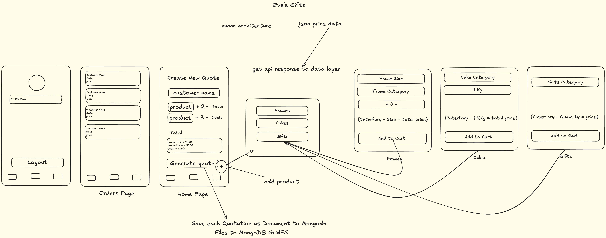

# Eve's Gifts

Building by - Sangeeth Amirthanathan

**Eve's Gofts** is an native android app to generate and view quotations for small startup gift shops, this app includes functionalities such as generate quotations as PDF that can be shared with the customers, viewing the past quotations, user authentication and all quatations successfully generated by user will be stored on MongoDB.

Time spent: TBA - building in progress

## UIs Implementations

UI | Custom FBA |  Bottom Nav Bar                                                                                   |
--- |------------|---------------------------------------------------------------------------------------------------|
Images |  |  |

## Functionalities

**Required** functionalities:

* [ ] customized composable screens
* [ ] modern animated components
* [ ] MVVM architecture lifecycle
* [ ] Navigations using navigation3
* [ ] fetch json api data
* [ ] generate quotation as pdf
* [ ] preview pdf
* [ ] save quotations to MongoDB
* [ ] retrieve quotations from db
* [ ] user authentication

The following **extensions** need to be implemented:

* [ ] User need to sign with their user credentials
* [ ] User can view home page that have generate quotation for categories of gifts
* [ ] custom bottom navigation bar
* [ ] custom composables widgets
* [ ] MVVM pattern
* [ ] user can see setting page that have profile details and logout
* [ ] user can generate quotations as pdf, share and saved on db
* [ ] view past quotations

## Video walkthrough for potrait

TAB

## Video walkthrough for session time out

TBA

## Video walkthrough for landscape

TBA

## Image Walkthrough

Here's a walkthrough of implemented user stories:

| Screen    | Login    | Home View    | Home with FAB    | Orders    | Quote                         | Profile |
|---|---|---|---|---|-------------------------------|---------|
| Images    |     |  |  |  |  |  |
# Screenshots Tablet
Screen | Landscape                                              |
--- |--------------------------------------------------------|
Images |  |

## Workflow Diagram

## License

    Copyright 2026 Sangeeth Amirthanathan, Eve's Gifts

    Licensed under the Apache License, Version 2.0 (the "License");
    you may not use this file except in compliance with the License.
    You may obtain a copy of the License at

        http://www.apache.org/licenses/LICENSE-2.0

    Unless required by applicable law or agreed to in writing, software
    distributed under the License is distributed on an "AS IS" BASIS,
    WITHOUT WARRANTIES OR CONDITIONS OF ANY KIND, either express or implied.
    See the License for the specific language governing permissions and
    limitations under the License.

